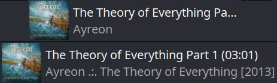

# PlasmaMediaControlEdit

## ⚠️ This no longer works in Plasma 6
I will work to port the same modifications over to work with Plasma 6

## Basic Reimplementation of the Media Control Plasma Widget (Plasma5 only)

>*Keeping for my own use in case of Plasma reinstall*

A simple chipping away at the original widget/applet to show more data. I currently added album, release date and track length. It also doesn't truncate the text so will expand as far as it needs to (example below).

*TODO*  
- [ ] Make Plasma 6 Compatible (Might need a separate version)
- [x] Forgot to add track number like in the [XFCE widget](../QuodlibetXFCE_Applet/)
- [x] Try to ensure it shows up as a different widget when adding to panel
