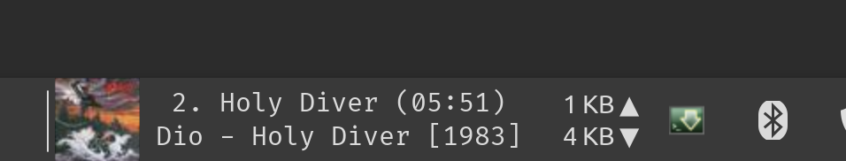

# Now playing applet for Quodlibet / XFCE

Just a simple applet thrown together in Python to display the currently playing song from Quodlibet in the XFCE Panel.

## Howto use
>Requires the GenMon applet:
>### Arch based distros:
>`sudo pacman -S xfce4-genmon-plugin`
>### Debian based:
>`sudo apt install xfce4-genmon-plugin`
>### Fedora based:
>`sudo dnf install xfce-genmon-plugin`

Once installed point the Generic Monitor applet to the script:
`/usr/bin/python [script/location]`

## Screenshot
