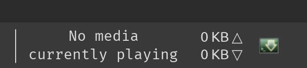

# Now playing applet for Quodlibet / XFCE

Just a simple applet thrown together in Python to display the currently playing song from Quodlibet in the XFCE Panel.

## Howto use
>Requires the GenMon applet:
>### Arch based distros:
>`sudo pacman -S xfce4-genmon-plugin`
>### Debian based:
>`sudo apt install xfce4-genmon-plugin`
>### Fedora based:
>`sudo dnf install xfce-genmon-plugin`

Once installed point the Generic Monitor applet to the script:
`/usr/bin/python [script/location]` 

Then select your prefered font and size.

# New Version (Not tied to QuodLibet)

I decided that in order for this to be useful, I would at lest need to make it compatible with other meadia players. I remembered that QuodLibet used a plugin to show it's status with DE's via dbus so investigated how to use that. 
>Afterall the notifications display the song information so I must be able to extract it *somehow*. 

The new script is called `anyPlaying.py` and does not need a hardcoded path in it. Just point the applet to `/usr/bin/python [script/location]`.

This should be compatible with all players that support mpris/DBus.

This script also now gets the cover art from the playing song, resizes it and displays it along with the song information.

## Requirements
```
pip install Pillow
```
For image resizing


## Screenshot



## ~~Additional Cover Art~~
~~I have modified the default `write_cover.py` plugin to resize the cover so it also fits on my XFCE taskbar.~~

~~Place the `cover_mod.py` file in `/usr/lib/python3.9/site-packages/quodlibet/etc/events` (requires root). Then create another genmon applet and set the command to `echo "/home/username/.config/quodlibet/cover.jpg<\img>`~~


# ~~TODO~~

[x] Try and get cover art to work with the one script.