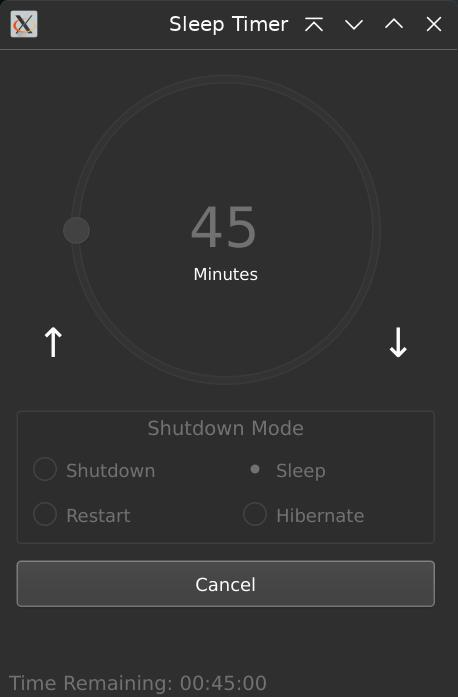

# SleepTimer

A simple python (and QT) app to sleep, hibernate, reboot or shutdown a system after a set period of time.

I made this to compliment a refurbished Surface Pro (hence simple UI) that I had recently purchased. All of the apps I found either didn't work, weren't optimized for touch, or ran on Electron. (Granted, the libraries for this will be quite large also, but I use Python anyway.)

Should work on Windows and Linux. 

## Requirements
```bash
pip install PyQt5

python main.py [--lodpi]
```

## HiDPI

The script will use HiDPI by default. If you wish to use the standard setting, pass --lodpi as an argument.

~~If you're not using a HiDPI screen, comment out:~~

```diff
- QtWidgets.QApplication.setAttribute(QtCore.Qt.AA_EnableHighDpiScaling, True) #enable highdpi scaling
- QtWidgets.QApplication.setAttribute(QtCore.Qt.AA_UseHighDpiPixmaps, True) #use highdpi icons
```

## TODO

- [ ] Pause playing audio when going to sleep
- [ ] Slowly adjust volume down (maybe in the last minute or two?)
- [ ] Possibly add brightness control
- [x] Make the dial and spinbox react to the time decreasing.
- [x] Make the UI more uniform on both platforms.
- [x] Okay I need to fix the UI on windows, it's pretty awful ~~(see screenshot)~~

## Screenshot

 
